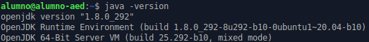
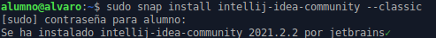

# Instalación del IDE IntelliJ IDEA

## Requisitos

Es necesario tener java instalado, en este caso, la versión 8:

## Instalación

Para instalar el IDE IntelliJ IDEA necesitamos ejecutar el siguiente comando:

## Lanzamiento de IntelliJ

Para ejecutar el IDE lo buscamos en el buscador de programas y nos debería aparecer el siguiente icono:

